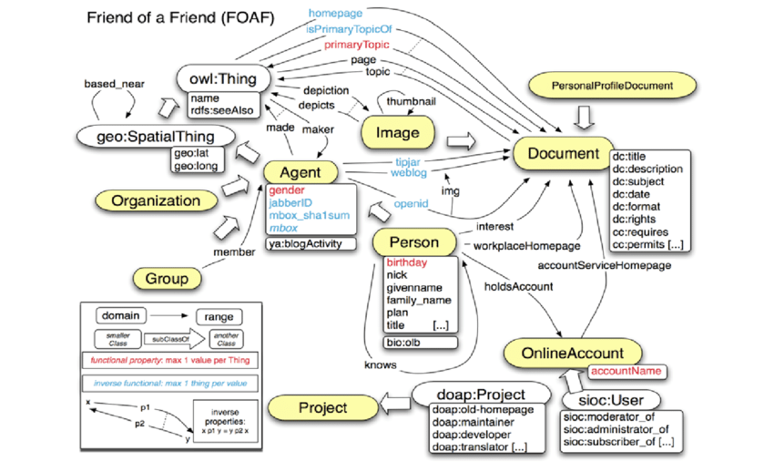

# context-aware-service-group5
Backend service handling requests in user context-aware manner. This service is not realy part of our prototype but shows
how we could make use of context information provided by the user of LPDC.

This information can be used by the LPDC microservices to improve the relevancy of search results and to influence the
behavior of the service capabilities based on the context of the user (location, role, time, emotion, ...).

The context information is conveyed preferably by using existing ontologies like FOAF (Friend of a Friend), 
See : https://lov.linkeddata.es/dataset/lov/vocabs/foaf

Part of FOAF terms by class and property:

More research has to be performed in order to find the best ontology to be used to convey the context information we
need in LPDC. FOAF is most probably just a part of it. We might look at SOUPA or CoDAMoS.